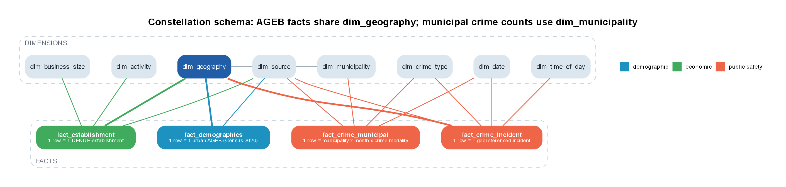

# Mérida Urban Intelligence — Geospatial Data Warehouse

A reproducible geospatial Data Warehouse in PostgreSQL/PostGIS that integrates demographic,
economic, geographic and public-safety data for the city of Mérida, Yucatán. It computes
territorial KPIs, compares areas inside the city and tests whether demographic, economic and
public-safety patterns are geographically associated.

```text
RAW (INEGI downloads) → CLEAN (pandas/GeoPandas) → SPATIAL JOIN (points → AGEB) → POSTGRESQL/POSTGIS DW → KPI views → spatial analysis
```

---

## 1. Project overview and analytical objective

The four sources do not share a geographic representation: the census is published as tables
keyed by statistical areas, DENUE and crime incidents are points, and the cartography is a set of
polygons. The project selects one geographic unit, moves every source onto it, loads the result
into a dimensional warehouse and answers three questions from the warehouse alone:

1. How are population, economic activity and public safety distributed across Mérida?
2. Which indicators move together across areas?
3. Do the indicators cluster in space, and where are the clusters and outliers?

## 2. Data sources

| Layer | Source | Edition | Original grain | Variables used |
|---|---|---|---|---|
| Demographic | INEGI, Censo de Población y Vivienda 2020 — principales resultados por AGEB y manzana urbana (Yucatán) | 2020 | one row per urban block, plus total rows per AGEB, locality, municipality and state | `POBTOT`, `POB0_14`, `POB15_64`, `POB65_MAS`, `P_12YMAS`, `PEA`, `POCUPADA`, `VIVTOT`, `TVIVHAB`, `PROM_OCUP` |
| Economic | INEGI, Directorio Estadístico Nacional de Unidades Económicas (DENUE), Yucatán | latest published (registrations up to 2026-04 at download) | one row per establishment | `id`, `codigo_act` (SCIAN), `nombre_act`, `per_ocu`, `cve_ent`, `cve_mun`, `cve_loc`, `ageb`, `latitud`, `longitud` |
| Geographic | INEGI, Marco Geoestadístico — Censo 2020 (Yucatán) | 2020 | one polygon per geostatistical area | layers `31a` (urban AGEB), `31m`, `31l`, `31mun`; key `CVEGEO` |
| Public safety | SESNSP, Incidencia delictiva del fuero común municipal (`IDM_NM_dic25.csv`) | 2015 to December 2025 | one row per municipality, year and crime modality, one column per month | `Año`, `Cve. Municipio`, `Bien jurídico afectado`, `Tipo de delito`, `Subtipo de delito`, `Modalidad`, `Enero`…`Diciembre` |

Download URLs, file names, sizes, SHA-256 checksums and download dates are recorded by the
download step in [`docs/source_manifest.json`](docs/source_manifest.json).

**Public-safety source.** No georeferenced incident dataset for Mérida was provided with the
brief, and none is published: outside Mexico City, prosecutors publish crime data only as monthly
counts per municipality. The project therefore uses the most detailed official source, the SESNSP
municipal incidence, and handles it honestly:

- it enters the warehouse as its own fact table at **municipality × month × crime modality**
  grain, with the municipality (and its 2020 population) as the geography;
- the crime KPIs are reported **at municipal level** (`dw.vw_kpi_crime_municipal_year`,
  `dw.vw_crime_municipal_month`);
- the counts are **never assigned to AGEBs**, because they have no location. The AGEB crime KPIs
  stay `NULL` (never zero) and the crime maps and Moran statistics are not produced.

A point-level path is also implemented and tested with a fixture in `tests/fixtures/`: a
georeferenced incident file read by [`src/extract_crime.py`](src/extract_crime.py) would be
cleaned, joined to AGEBs, loaded into `fact_crime_incident`, and would switch on the AGEB crime
KPIs, maps, correlations and Moran statistics without other changes.

The SESNSP file is served from a CDN that rejects non-browser clients, so it is the only source
that has to be downloaded with a web browser (see section 9); the download step then verifies it
and records its checksum.

## 3. Geographic strategy

Full justification and figures: [`docs/geographic_unit_decision.md`](docs/geographic_unit_decision.md);
evidence: [`notebooks/01_data_geographic_assessment.ipynb`](notebooks/01_data_geographic_assessment.ipynb).

| Candidate | Polygons | Census results | Units in Mérida | Decision |
|---|---|---|---|---|
| Block (manzana) | yes | yes, heavily withheld for confidentiality | 17,595 | rejected: median of 52 residents, 23.5% of blocks withhold the 65+ population, 33% have no business |
| **Urban AGEB** | **yes** | **yes, 526 of 526 keys match** | **526** | **selected** |
| Colonia | not published by INEGI | none | — | rejected: would require estimating population by areal interpolation |
| Locality | yes | yes | 53 | rejected: one locality holds 483 of the 526 AGEBs |

**Study area:** the 526 urban AGEBs of the municipality of Mérida (`31050`), 259.9 km², with
957,399 of the municipality's 995,129 inhabitants (96.2%).

**CRS.** The INEGI shapefiles carry the Mexico ITRF2008 / LCC projection without an EPSG code;
their parameters were compared with EPSG:6372 and found identical, so the layers are declared as
EPSG:6372. Areas are measured in EPSG:6372 (metres); geometries are stored in EPSG:4326, the CRS of
the latitude/longitude sources.

**Latitude/longitude to polygon.** Points are built from WGS84 coordinates and assigned to the
AGEB that contains them (`within`); a point lying exactly on a shared edge goes to the touching
AGEB with the lowest `CVEGEO`; any other point is kept in an audit table with the reason.

| Establishments (DENUE, municipality of Mérida) | Count |
|---|---|
| With valid coordinates | 56,909 |
| Assigned to an urban AGEB | 56,664 (99.57%) |
| Not inside any urban AGEB | 245 (165 declared by INEGI in a rural area) |
| Spatial AGEB equal to the AGEB declared by DENUE | 99.82% of assigned |

## 4. ETL pipeline

| Stage | Module | Main decisions |
|---|---|---|
| Download | `src/download.py` | raw files written once, never modified; checksum verified on every run |
| Clean geography | `src/clean_geography.py` | AGEBs of `31050`; validity checked and repaired if needed; area in EPSG:6372; MultiPolygon in EPSG:4326 |
| Clean census | `src/clean_census.py` | **grain change:** keeps the AGEB total rows published by INEGI instead of summing blocks, because withheld block values would make sums fall short; `*` and `N/D` become `NULL` with a `has_suppressed` flag, never zero |
| Clean DENUE | `src/clean_denue.py`, `src/scian.py` | filter municipality `050`; Latin-1 decoding; duplicate ids removed; coordinates validated; SCIAN sector names (31–33 and 48–49 share one name); groups retail = 46, service = 51–81, other |
| Extract and clean crime | `src/extract_crime.py`, `src/clean_crime.py` | fixed output layout; invalid coordinates dropped and counted; exact duplicates (place, type, date, hour) collapsed; date and hour keys; harmonised crime group |
| Spatial join | `src/spatial_join.py` | **representation change:** points become AGEB members (rule in section 3); unmatched points kept with a reason; report in `outputs/spatial_join_report.json` |
| Load | `src/load_dw.py`, `sql/01`–`04` | rebuild schemas, load `staging`, populate the star schema, create KPI views, run validations; any failed check stops the pipeline |

## 5. PostgreSQL/PostGIS setup and Data Warehouse model

Setup instructions: [`docs/database_setup.md`](docs/database_setup.md) (Docker recommended).

The warehouse is a **constellation schema**: three fact tables share the conformed dimension
`dim_geography`, which is what allows indicators that mix layers.



| Fact table | Grain | Measures | Dimensions |
|---|---|---|---|
| `fact_demographics` | one urban AGEB, Census 2020 | population totals and age groups, population 12+, economically active and employed population, dwellings | geography, source |
| `fact_establishment` | one DENUE establishment inside an urban AGEB | `establishment_count` (=1), point geometry | geography, activity, business size, source |
| `fact_crime_incident` | one georeferenced incident inside an urban AGEB | `incident_count` (=1), point geometry | geography, crime type, date, time of day, source |
| `fact_crime_municipal` | one municipality × month × crime modality (SESNSP) | `incidents` | municipality, crime type, date, source |

| Dimension | Grain |
|---|---|
| `dim_geography` | one urban AGEB: `CVEGEO`, hierarchy codes, names, `area_km2`, polygon, interior point |
| `dim_municipality` | one municipality: key, name, area, 2020 population, polygon |
| `dim_activity` | one SCIAN activity class with sector and sector group |
| `dim_business_size` | one DENUE employment stratum |
| `dim_crime_type` | one published crime subtype with its category and group (SESNSP legal good affected) |
| `dim_date`, `dim_time_of_day` | one calendar day / one hour, with unknown members |
| `dim_source` | one dataset, with URL, edition, download date and checksum |

Full model with every column and key: [`docs/warehouse_model.png`](docs/warehouse_model.png).
Data dictionary generated from the database catalog: [`docs/data_dictionary.md`](docs/data_dictionary.md).

**Validation** (`sql/04_validation.sql`, results in `outputs/load_validation.json`): row counts
staging = warehouse, census/polygon key match, referential integrity, reconciliation of population
and point counts with the cleaned sources, geometry validity and SRID, every establishment inside
its AGEB, and agreement with the AGEB declared by DENUE.

## 6. KPI definitions and formulas

All KPIs are SQL views in `sql/03_views.sql`; `dw.vw_kpi_ageb` has one row per AGEB. A KPI whose
denominator is zero or unknown is `NULL`. Results of one validation query per KPI:
[`outputs/kpi_validation.md`](outputs/kpi_validation.md).

| # | KPI | Column | Formula |
|---|---|---|---|
| 1 | Total Population | `pop_total` | census total population |
| 2 | Population Density | `pop_density_km2` | population / area (km²) |
| 3 | Economically Active Population Rate | `pea_rate_pct` | 100 × economically active population / population aged 12+ |
| 4 | Population by Age Group | `share_0_14_pct`, `share_15_64_pct`, `share_65_plus_pct`; `vw_population_by_age` | 100 × group / population |
| 5 | Total Businesses | `businesses_total` | count of establishments |
| 6 | Business Density | `business_density_km2` | establishments / area |
| 7 | Businesses per 1,000 Residents | `businesses_per_1000` | 1,000 × establishments / population |
| 8 | Retail Density | `retail_density_km2` | retail establishments (SCIAN 46) / area |
| 9 | Service Density | `service_density_km2` | service establishments (SCIAN 51–81) / area |
| 10 | Dominant Economic Activity | `dominant_sector`, `dominant_sector_share_pct` | sector with most establishments; ties broken by sector code |
| 11 | Total Crime Incidents | `crimes_total` | count of incidents |
| 12 | Crime Rate | `crime_rate_per_1000` | 1,000 × incidents / population |
| 13 | Incidents by Type and Time | `vw_crime_by_type_time` | incidents by type, group, year, month, weekday and part of day |
| 14 | Crime relative to Business Activity | `crimes_per_100_businesses` | 100 × incidents / establishments |

City level (`dw.vw_kpi_city`): 957,399 inhabitants on 259.9 km² (3,684 per km²), 56,664
establishments (218 per km², 59.2 per 1,000 residents), economically active population rate 63.2%.

**Crime KPIs at municipal level** (`dw.vw_kpi_crime_municipal_year`, `dw.vw_crime_municipal_month`):
in 2025 the municipality recorded 3,135 incidents, 3.15 per 1,000 residents (population 2020) and
5.53 per 100 establishments; property crimes were the largest specific group. KPI 13 by type and
month is `dw.vw_crime_municipal_month`. KPIs 11–14 per AGEB (`crimes_total`,
`crime_rate_per_1000`, `crimes_per_100_businesses` in `vw_kpi_ageb`) remain `NULL` until a
georeferenced source exists.

## 7. Spatial analysis

[`notebooks/03_spatial_analysis.ipynb`](notebooks/03_spatial_analysis.ipynb) reads only warehouse
views and runs the three analysis modules.

- **Maps** (`src/analysis/kpi_maps.py` → `outputs/maps/`): quantile choropleths of the KPIs and the
  dominant activity.
- **Correlation** (`src/analysis/correlations.py` → `outputs/correlations.csv`): Spearman's ρ as
  the primary measure, Pearson's r on log(1 + x) as a check.
- **Spatial autocorrelation** (`src/analysis/spatial_autocorrelation.py` →
  `outputs/moran_results.csv`, `outputs/lisa_clusters.csv`): global Moran's I, Local Moran's I
  (LISA) and bivariate Moran's I.

**Neighbourhood rule.** Queen contiguity (shared edge or vertex), row-standardised, on log(1 + x)
values; 999 permutations with a fixed seed; α = 0.05; AGEBs without neighbours (2 detached AGEBs)
are excluded and reported. Only touching AGEBs influence each other, so neighbours separated by a
road reserve are ignored, and the large peripheral AGEBs, having fewer neighbours, give less
stable local results.

## 8. Repository structure

```text
├── README.md
├── requirements.txt            pinned Python environment
├── docker-compose.yml          PostgreSQL 17 + PostGIS 3.5
├── .env.example                database connection settings
├── data/raw/                   original downloads, never edited (not versioned)
├── data/processed/             cleaned intermediates (not versioned)
├── notebooks/
│   ├── 01_data_geographic_assessment.ipynb
│   └── 03_spatial_analysis.ipynb
├── src/
│   ├── config.py               paths, study area, CRS, database URL
│   ├── download.py             sources and provenance manifest
│   ├── extract_crime.py        the only module that knows the crime source
│   ├── clean_*.py, scian.py    cleaning and derived attributes
│   ├── spatial_join.py         points to AGEB
│   ├── load_dw.py              staging load, SQL scripts, validation
│   ├── run_pipeline.py         single entry point
│   ├── validate_kpis.py, make_data_dictionary.py, make_model_diagram.py
│   └── analysis/               maps, correlations, spatial autocorrelation
├── sql/
│   ├── 01_schema.sql           schemas, dimensions, facts, grain comments
│   ├── 02_load.sql             staging to star schema
│   ├── 03_views.sql            KPI views
│   ├── 04_validation.sql       load checks
│   └── 05_kpi_validation_queries.sql
├── tests/                      transforms and crime-extract layout
├── docs/                       decisions, data dictionary, model diagrams, setup
│   ├── report/                 technical report (PDF) and its build script
│   └── presentation/           slides (PDF) and their build script
└── outputs/                    maps, figures, validation and analysis results
```

## 9. How to reproduce

Requirements: Python 3.12, Docker (or a local PostgreSQL with PostGIS, see
`docs/database_setup.md`), and Graphviz only to redraw the model diagrams.

```bash
git clone https://github.com/ezraidenn/Datawarehouse-E2.git
cd Datawarehouse-E2
python -m venv .venv
source .venv/Scripts/activate             # Linux/macOS: source .venv/bin/activate
pip install -r requirements.txt
cp .env.example .env                      # set PGPASSWORD (and PGPORT if 5432 is busy)
docker compose up -d                      # PostgreSQL + PostGIS

# 0. Crime source (browser only): open the SESNSP URL listed in docs/source_manifest.json
#    and save IDM_NM_dic25.csv as data/raw/crime_municipal/IDM_NM_dic25.csv (≈ 380 MB)
python -m src.download                    # 1. INEGI sources into data/raw (≈ 67 MB), verify all
python -m src.run_pipeline                # 2. clean → spatial join → load → validate
python -m src.validate_kpis               # 3. one query per KPI → outputs/kpi_validation.md
python -m src.analysis.kpi_maps           # 4. maps
python -m src.analysis.correlations       # 5. correlations
python -m src.analysis.spatial_autocorrelation   # 6. Moran, LISA, bivariate
python -m src.analysis.crime_municipal    # 7. municipal crime KPIs and figures
python -m src.make_data_dictionary        # optional: regenerate the data dictionary
python -m src.make_model_diagram          # optional: regenerate the model diagrams
python docs/report/build_report.py        # optional: rebuild the technical report (needs Chrome)
python docs/presentation/build_slides.py  # optional: rebuild the slides (needs Chrome)
pytest                                    # unit tests
```

The pipeline exits with a non-zero code if any validation fails; running it again rebuilds the
warehouse with identical results. To add the public-safety layer, place the incident file in
`data/raw/crime/`, describe its columns in `CRIME_SOURCE` inside `src/extract_crime.py`, and run
steps 2 to 6 again.

## 10. Assumptions, data-quality issues and limitations

- **Public safety without location.** Official crime data for Mérida have no coordinates, so crime
  is analysed only at municipal level and cannot be related to AGEBs (section 2).
- **Breaks in the crime series.** Monthly SESNSP counts for Mérida drop abruptly in mid-2017 and
  mid-2021 (21,829 incidents in 2015, 1,820 in 2022), which suggests changes in recording rather
  than in crime; the report uses the latest full year and does not interpret long-term trends.
  Municipal rates use the 2020 population and current establishments as denominators.
- **Withheld census values.** 18 AGEBs withhold at least one value for confidentiality; those
  values are `NULL` and excluded from rates, never imputed.
- **Low-population AGEBs.** 6 AGEBs have no residents and 32 have fewer than 100; per-capita KPIs
  there are extreme (one AGEB has 3 residents and 80 establishments) and are flagged
  (`low_population`) and excluded from per-capita statistics.
- **Reference dates.** Population and boundaries refer to 2020; establishments come from the
  latest DENUE edition. Ratios that mix them are approximations, and growth after 2020 outside the
  2020 urban AGEBs is not covered.
- **Establishments outside the study area.** 245 establishments are not inside any urban AGEB
  (165 are declared by INEGI in rural areas); they are kept in `staging.unmatched_points` and
  excluded from AGEB indicators.
- **DENUE coverage.** DENUE lists fixed and semi-fixed establishments; street vending and
  home-based informal activity are under-represented.
- **Modifiable areal unit problem and ecological fallacy.** Results depend on AGEB boundaries and
  describe areas, not individuals.
- **Spatial association is not causation.** Correlations and Moran statistics describe how areas
  co-vary in space; positive spatial autocorrelation also means that ordinary significance tests
  overstate the evidence.
