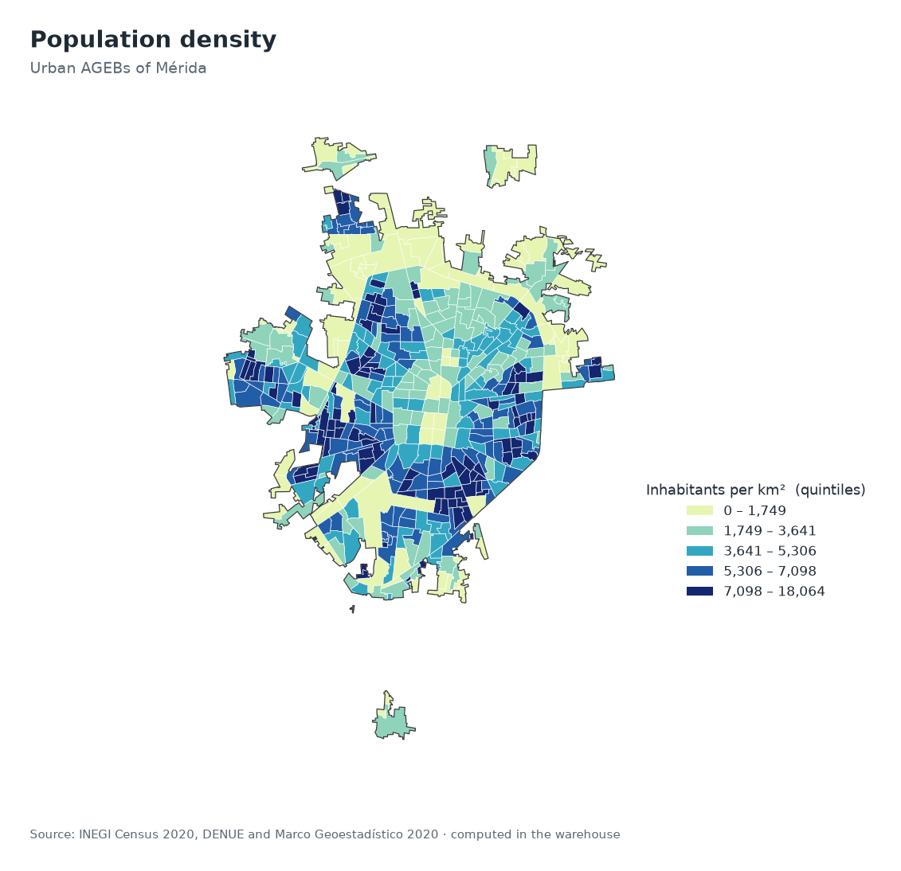

# Study area

## Definition
The study area is the municipality of Mérida, Yucatán, code 31050. It is represented by the 526 urban AGEBs of the 2020 Marco Geoestadístico, covering 259.9 km² and 957,399 residents, or 96.2% of the municipality’s population.

## Urban localities included
| Locality code | Locality | Urban AGEBs |
|---|---|---|
| 0001 | Mérida | 483 |
| 0075 | Caucel | 10 |
| 0077 | Chablekal | 8 |
| 0084 | Cholul | 13 |
| 0093 | Komchén | 8 |
| 0111 | San José Tzal | 4 |

## What is outside the study area
Rural localities and rural parts of the municipality do not contain urban AGEBs, so they are not analysed in this project. The 245 establishments reported outside every urban AGEB in `outputs/spatial_join_report.json` are kept in the audit table and excluded from AGEB-level indicators.

